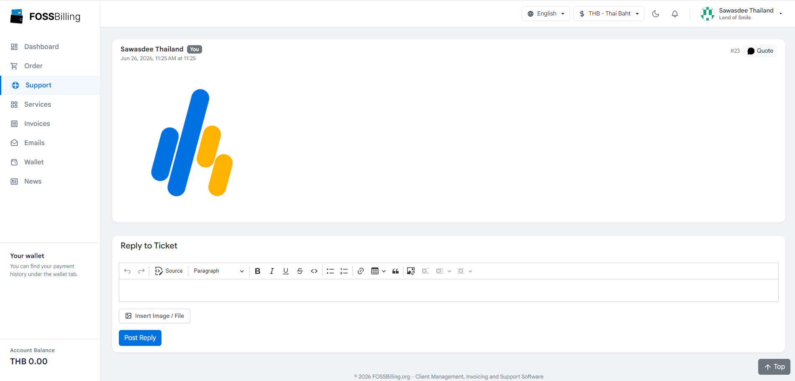

# FOSSBilling Support Ticket Attachments

A clean, inline attachment upload module for FOSSBilling. This extension allows clients and admins to seamlessly attach images and files to support tickets directly through the ticket editor.

**Compatible with FOSSBilling 0.8.x**

## Features

- **Inline Uploads**: No clunky attachment lists. Attachments are uploaded and instantly inserted into the ticket editor as clickable links or inline images.
- **Support for Both Ends**: Fully supports both the Client Area and the Admin Area with the exact same streamlined experience.
- **Secure Validation**: Validates file size (Max 5MB) and MIME types server-side to prevent malicious uploads.
- **Automatic Cleanup**: When a ticket is deleted, all associated attachments and files on disk are automatically removed to prevent storage leaks.
- **Zero Config**: Plug and play. No complex configuration required.

## Installation

1. Download the latest release `.zip` file.
2. Extract the archive. You will find two folders: `Supportticketattachments` and `theme_override`.
3. **Install the Module core**:
   - Upload the `Supportticketattachments` folder into the `modules/` directory of your FOSSBilling installation.
   - *Example Path:* `[FOSSBilling_Root]/modules/Supportticketattachments/`
4. **Install the Theme Overrides**:
   - For the **Client Area**: We have provided overrides for several themes (`huraga`, `tide`, `sawasdee`).
     - Choose the folder that matches your active client theme in `theme_override/client/`.
     - Copy the `mod_support_ticket.html.twig` file to: `[FOSSBilling_Root]/themes/[your_theme_name]/html_custom/mod_support_ticket.html.twig`
     - *Example for Huraga:* Copy from `theme_override/client/huraga/mod_support_ticket.html.twig` to `[FOSSBilling_Root]/themes/huraga/html_custom/mod_support_ticket.html.twig`
   - For the **Admin Area**: We have provided an override for `admin_default`.
     - Copy `theme_override/admin/admin_default/mod_support_ticket.html.twig` to: `[FOSSBilling_Root]/themes/admin_default/html_custom/mod_support_ticket.html.twig`
5. Log into your FOSSBilling admin panel.
6. Go to **Extensions > Modules** and click the play icon to **activate** the `Support Ticket Attachments` module.
7. Clear your FOSSBilling cache by going to **Settings -> Advanced -> Clear cache**.
8. Refresh your browser cache (Ctrl + F5) and the setup is complete!

## Usage

Simply open any support ticket. You will see a new `Insert Image / File` button located right below the rich text editor. 

1. Click the button to select one or multiple files.
2. The upload progress will be displayed.
3. Once complete, the file will be automatically inserted into the text editor at your cursor position.

## Technical Details

- **Upload Path**: Files are stored securely in `data/uploads/sta`.
- **Database**: Creates a `support_ticket_attachment` table to track files.
- **Allowed Extensions**: `jpg`, `jpeg`, `png`, `gif`, `pdf`, `doc`, `docx`, `txt`, `zip`.
- **Max File Size**: 5 MB (configurable in `Service.php`).

## License

This project is licensed under the MIT License - see the [LICENSE](LICENSE) file for details.

## ❤️ Donate

Support this project:

- **$5** → [https://linksplus.omise.co/lN1VTj2Obw](https://linksplus.omise.co/lN1VTj2Obw)
- **$10** → [https://linksplus.omise.co/3zeILGb32v](https://linksplus.omise.co/3zeILGb32v)
- **$25** → [https://linksplus.omise.co/cckjTvJlHq](https://linksplus.omise.co/cckjTvJlHq)
- **$50** → [https://linksplus.omise.co/XmW40xA4yE](https://linksplus.omise.co/XmW40xA4yE)
